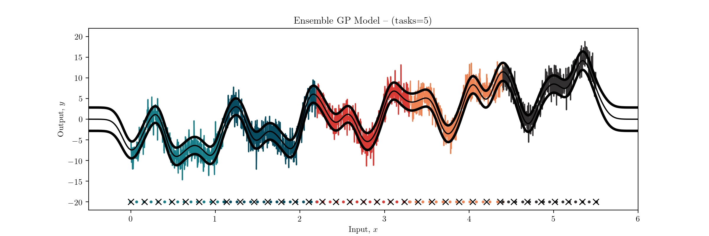

# Recyclable Gaussian Processes

This repository contains the Pytorch implementation of Recyclable Gaussian Processes. We provide a detailed code for single-output GP regression and GP classification with both synthetic and real-world data.

Please, if you use this code, cite the following [preprint](https://arxiv.org/abs/2010.02554):
```
@article{MorenoArtesAlvarez19,
  title = {Recyclable Gaussian Processes},
  author = {Moreno-Mu\~noz, Pablo and Art\'es-Rodr\'iguez, Antonio and \'Alvarez, Mauricio A},
  journal = {arXiv preprint arXiv:2010.02554},
  year = {2020}
}
```
*Ensemble of 5 recyclable GPs.*



**Results:** In the /experiments/ folder you may find the following scripts for simulations.

```
parallel.py // Recyclable GP regression with toy data
banana.py  // Recyclable GP classification with binary data
```

The Pytorch structure of our code is based on the [gptorch](https://github.com/sdatkinson/gptorch) library by S. Atkinson.

## Contributors

[Pablo Moreno-Muñoz](http://www.tsc.uc3m.es/~pmoreno/), [Antonio Artés-Rodríguez](http://www.tsc.uc3m.es/~antonio/) and [Mauricio A. Álvarez](https://maalvarezl.github.io/)

For further information or contact:
```
pmoreno@tsc.uc3m.es
```
